# Portfolio Project: AI Sales Pairing Model Effectiveness Analysis

**Author**: Anas Riaz | [**LinkedIn**]([https://www.linkedin.com/in/raoanasriaz/]) | [**GitHub**]([https://github.com/rao-anas-riaz])

<p align="center">
  
  
  
  
  
  
  
  
</p>

---

## Table of Contents
1. [Project Overview](#project-overview)
2. [Live Report & Assets](#live-report--assets)
3. [Technology Stack](#technology-stack)
4. [Project Architecture](#project-architecture)
5. [Data Model (Star Schema)](#data-model-star-schema)
6. [End-to-End Project Walkthrough](#end-to-end-project-walkthrough)
    - [Step 1: Environment & Version Control Setup](#step-1-environment--version-control-setup)
    - [Step 2: Professional Cloud Data Pipeline with Azure](#step-2-professional-cloud-data-pipeline-with-azure)
    - [Step 3: Data Transformation & Profiling](#step-3-data-transformation--profiling)
    - [Step 4: Data Modeling & Performance Optimization](#step-4-data-modeling--performance-optimization)
    - [Step 5: Business Logic with Advanced DAX](#step-5-business-logic-with-advanced-dax)
    - [Step 6: Visualization & Data Storytelling](#step-6-visualization--data-storytelling)
    - [Step 7: Advanced Analytics & Interactive UX](#step-7-advanced-analytics--interactive-ux)
    - [Step 8: Enterprise Deployment & Security](#step-8-enterprise-deployment--security)
7. [Project Assets File Structure](#project-assets-file-structure)
8. [Conclusion & Key Takeaways](#conclusion--key-takeaways)

---

## Project Overview

This project demonstrates a complete, end-to-end business intelligence solution built to analyze the effectiveness of a new AI-driven sales pairing model at a telecommunications company. The primary business objective was to determine, with statistical confidence, whether the new AI model provided a tangible uplift in sales conversion rates compared to the traditional routing system.

The solution encompasses the entire BI lifecycle: from data simulation and cloud data engineering in **Microsoft Azure** to advanced data modeling, DAX calculations, and the development of a multi-page, interactive dashboard in **Power BI**. The final report provides a clear, data-driven narrative that allows stakeholders to understand the AI model's financial impact and identify the key drivers of sales success.

---

## Live Report & Assets

Below are the links to the interactive report and other project deliverables. Due to organizational policies, a direct public link may not be available. In such cases, a video demonstration and screenshots are provided to showcase the report's full interactivity and design.

| Asset Type                      | Link                                                                                                                             | Description                                                                                             |
| ------------------------------- | -------------------------------------------------------------------------------------------------------------------------------- | ------------------------------------------------------------------------------------------------------- |
| **Live Interactive Report**     | [**Click to View**](https://app.powerbi.com/reportEmbed?reportId=53469f86-05b5-4de8-a5d9-eee1050da595&autoAuth=true&ctid=37d99f3a-a812-47a6-a7ee-9adc84ec615c)                                                                                | The fully interactive, multi-page Power BI report. *(May require login or be disabled by admin policies)* |
| **Video Demonstration (MP4)**   | [**Watch Video**](./assets/video/report_demo.mp4)                                                                                  | A video walkthrough demonstrating the report's features, slicers, tooltips, and navigation.             |
| **Report Export (PDF)**         | [**Download PDF**](./assets/docs/report_export.pdf)                                                                                | A static PDF export of the main report pages.                                                           |
| **Report Export (PowerPoint)**  | [**Download PowerPoint**](./assets/docs/report_export.pptx)                                                                        | A static PowerPoint export of the report, with live links to the Power BI service.                      |
| **Power BI Project File (.pbix)** | [**Download PBIX**](powerbi-ai-sales-analysis.pbix)                                                                                      | The complete Power BI project file, containing the data model, queries, and visuals.                    |

---

## Technology Stack

| Category                  | Technologies Used                                                              |
| ------------------------- | ------------------------------------------------------------------------------ |
| **BI & Visualization**    | Power BI Desktop, Power BI Service                                             |
| **Cloud Platform**        | Microsoft Azure (Azure Data Lake, Azure Data Factory, Azure SQL Database)      |
| **Languages**             | DAX, M (Power Query), SQL, Python (Pandas, Faker)                              |
| **Advanced Tools**        | DAX Studio, Tabular Editor                                                     |
| **Version Control**       | Git & GitHub                                                                   |

---

## Project Architecture

The solution follows a modern, cloud-based data architecture, ensuring scalability, automation, and a clear separation of concerns from data ingestion to final presentation. The entire suite of Azure resources was managed within a single resource group for streamlined deployment and cleanup.

```
[Data Source: Python Script] -> [Staging: Azure Data Lake] -> [ETL: Azure Data Factory] -> [Warehouse: Azure SQL DB] -> [Reporting: Power BI]
```

<p align="center">
  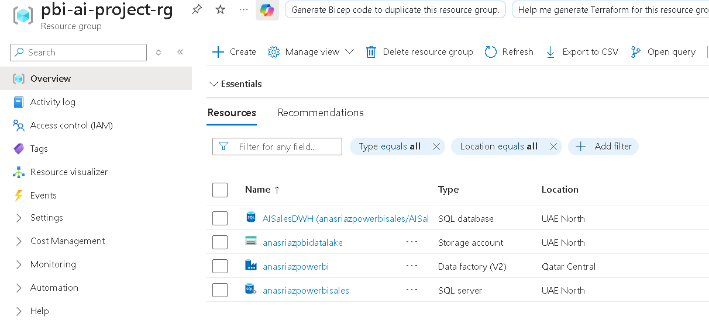
  <br/><em>All cloud resources for the project, managed within a single Azure Resource Group.</em>
</p>

---

## Data Model (Star Schema)

A performance-optimized star schema was implemented as the foundation for the Power BI report. This model is the industry best practice, providing an intuitive structure for analysts and enabling fast query performance for a responsive user experience.

*   **Fact Table**: `Fact_CallLogs` (Contains quantitative measures like SaleValue and event flags like SaleMade)
*   **Dimension Tables**: `Dim_Agents`, `Dim_Customers`, `Dim_Date` (Contain descriptive attributes)

<p align="center">
  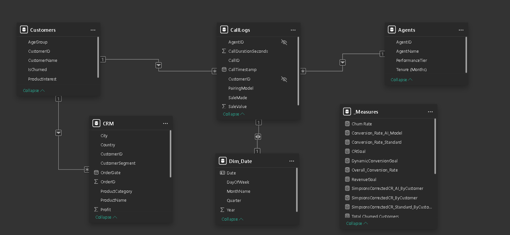
  <br/><em>The final star schema data model in Power BI, optimized for performance and clarity.</em>
</p>

---

## End-to-End Project Walkthrough

This section details the systematic process followed to build the solution, highlighting key technical skills and best practices at each stage.

### Step 1: Environment & Version Control Setup
*   **Professional Tooling**: Set up a development environment with **Power BI Desktop**, and integrated external tools like **DAX Studio** for performance tuning and **Tabular Editor** for advanced, script-based data modeling.
*   **Cloud Foundation**: Provisioned a free-tier **Microsoft Azure** account and a **Power BI Pro** license (via Fabric trial), with a critical **$1 billing alert** configured for proactive cost management.
*   **Version Control**: Initialized a **Git** repository and created a corresponding public repository on **GitHub** to track all project assets and document the development process.

### Step 2: Professional Cloud Data Pipeline with Azure
*   **Staging Layer**: Established an **Azure Data Lake Storage (ADLS) Gen2** account to serve as the landing zone for raw, simulated CSV data.
*   **Data Warehouse**: Deployed a serverless **Azure SQL Database** to act as the structured data warehouse, providing a clean, queryable source for Power BI.
*   **ETL Orchestration**: Built a professional-grade ETL pipeline in **Azure Data Factory (ADF)** with robust control flow. The entire process was automated with a scheduled trigger to run daily.

<p align="center">
  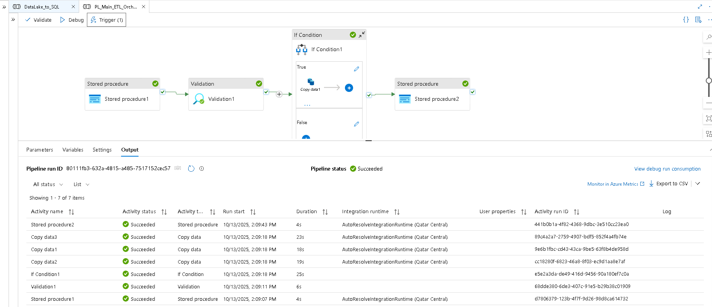
  <br/><em>A professional-grade ETL pipeline in Azure Data Factory with logging, validation, and control flow.</em>
</p>

<p align="center">
  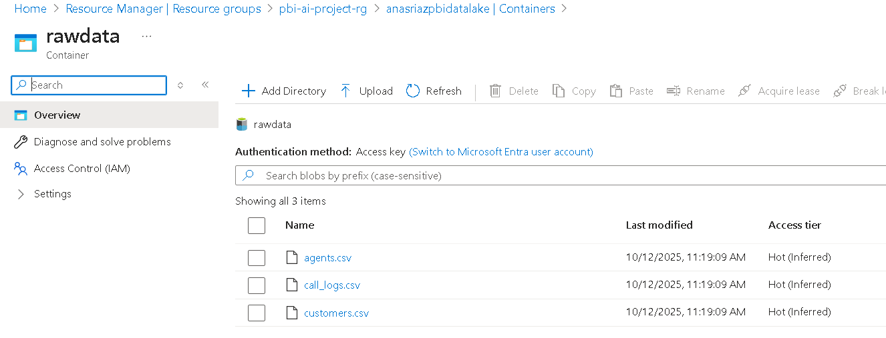
  <br/><em>Raw CSV files staged in the Azure Data Lake container.</em>
</p>

<p align="center">
  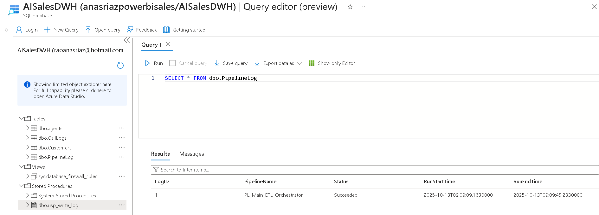
  <br/><em>The custom SQL log table, providing an auditable record of pipeline executions.</em>
</p>

### Step 3: Data Transformation & Profiling
*   **Data Cleaning**: Performed systematic data cleaning within the Power Query Editor, including correcting data types, renaming columns for business clarity, and handling null or error values.
*   **Advanced Data Profiling**: Leveraged Power Query's built-in data profiling tools (Column Quality, Distribution, Profile) to analyze data distributions and identify quality issues early in the process, ensuring a robust and trustworthy dataset.

<p align="center">
  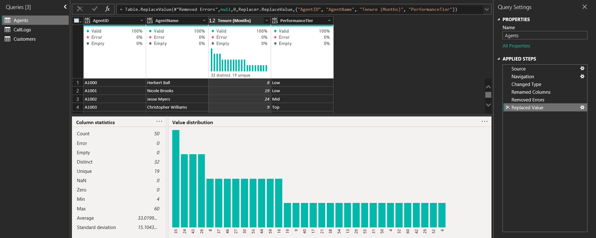
  <br/><em>Using data profiling tools in the Power Query Editor to ensure data quality and integrity.</em>
</p>


### Step 4: Data Modeling & Performance Optimization
*   **Relationship Building**: Constructed the star schema in the Power BI Model View by creating one-to-many relationships from dimension tables to the fact table.
*   **Date Dimension**: Created a dedicated, dynamic Date dimension using the `CALENDARAUTO()` DAX function and marked it as a date table—a crucial step for enabling time-intelligence functions.
*   **Performance Tuning**: Applied modeling best practices by hiding foreign keys and diagnosing query performance using Power BI's **Performance Analyzer**.

### Step 5: Business Logic with Advanced DAX
*   **Centralized Logic & Best Practices**: Created a dedicated `_Measures` table to centralize all business calculations. Adhered strictly to the best practice of writing **explicit measures** for all calculations.
*   **Core & Comparative KPIs**: Wrote explicit DAX measures for core business metrics. Leveraged the `CALCULATE` function to create filtered measures that calculated the conversion rate specifically for the "AI-Optimized" model versus the "Standard" model.
*   **Advanced Time Intelligence**: Implemented robust Year-over-Year (YoY) growth calculations using DAX time-intelligence functions like `SAMEPERIODLASTYEAR`.

### Step 6: Visualization & Data Storytelling
*   **Purpose-Driven Reports**: Designed a multi-page "application" within Power BI, with each page tailored to a specific audience and purpose, such as an executive summary and a detailed agent performance view.
*   **Effective Visuals**: Selected appropriate visuals for the data, including **Line Charts** for time-series analysis, **Bar Charts** for categorical comparisons, **KPI Cards** for key metrics, and **Slicers** for interactive filtering.

<p align="center">
  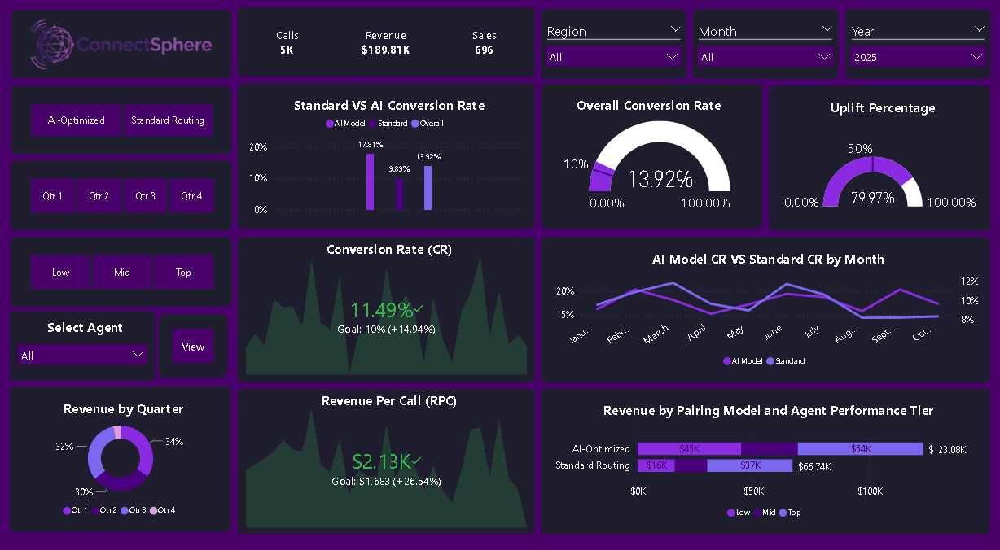
  <br/><em>The primary "AI Performance Dashboard" page, providing an at-a-glance summary for executive stakeholders.</em>
</p>

<p align="center">
  
  <br/><em>Short animated demo showcasing the report's interactivity.</em>
</p>

<p align="center">
  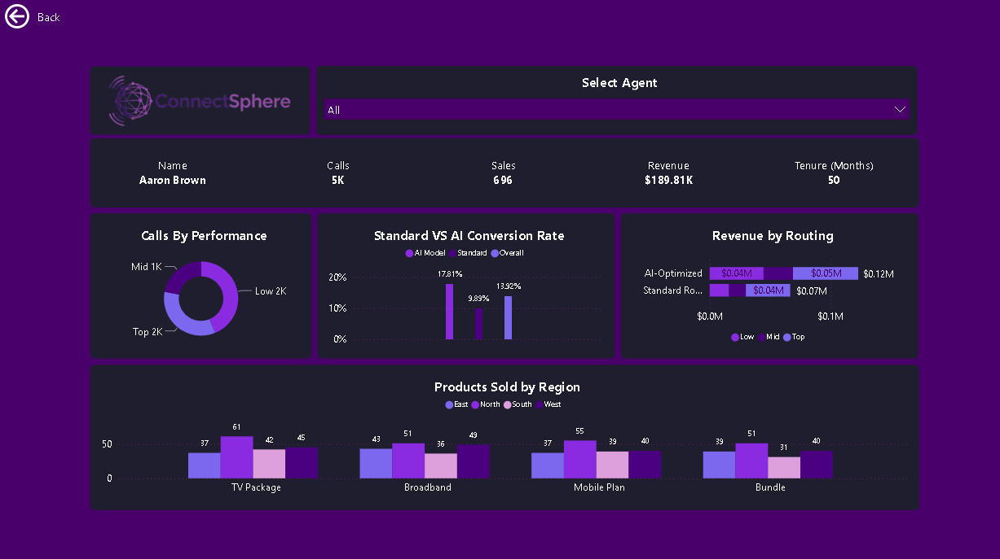
  <br/><em>The "Agent Deep Dive" page, allowing managers to analyze individual performance.</em>
</p>

### Step 7: Advanced Analytics & Interactive UX
*   **AI-Driven Insights**: Utilized Power BI's built-in AI features to uncover deeper insights automatically:
    *   **Key Influencers Visual**: Identified the primary statistical drivers behind successful sales, revealing that the AI Pairing Model increased the likelihood of a sale by 1.8x.
    *   **Decomposition Tree**: Enabled dynamic, ad-hoc root cause analysis by allowing users to break down metrics across multiple dimensions.
    *   **Clustering**: Used the scatter chart's clustering feature to automatically segment customers into distinct groups based on their revenue and conversion rate behavior.
*   **Enhanced Interactivity**: Implemented a suite of advanced features to create a dynamic, app-like user experience, including **Bookmark-Driven Navigation**, **Drillthrough**, and **Custom Report Tooltips**.

<p align="center">
  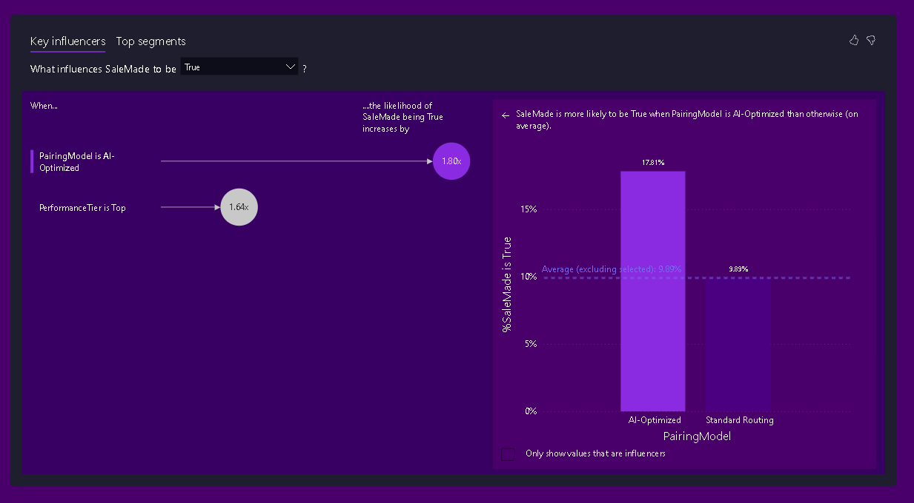
  <br/><em>The Key Influencers visual identifying the top factors driving sales.</em>
</p>
<p align="center">
  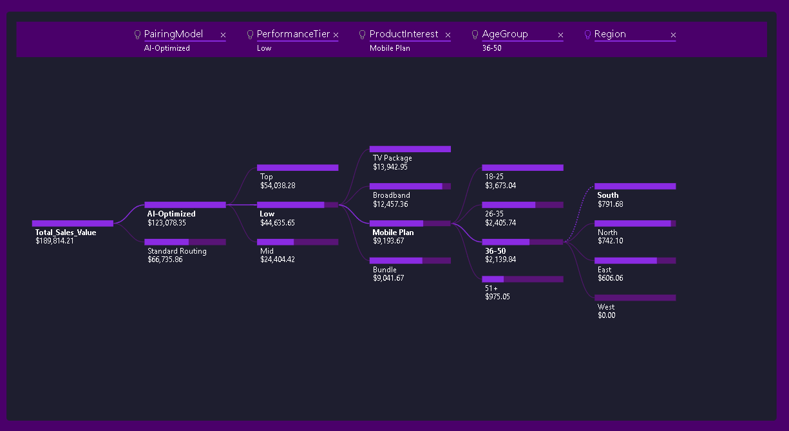
  <br/><em>The Decomposition Tree visual used for root cause analysis.</em>
</p>
<p align="center">
  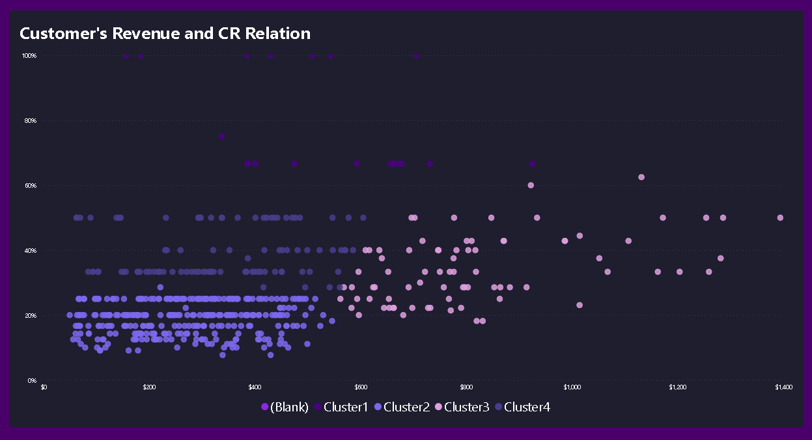
  <br/><em>The Clustering algorithm automatically segmenting customers.</em>
</p>

### Step 8: Enterprise Deployment & Security
*   **Publishing & Workspaces**: Published the final report to a dedicated **Workspace** in the Power BI Service for collaboration and management.
*   **Scheduled Refresh**: Configured data source credentials (using OAuth2 for security) and set up a **Scheduled Refresh** to ensure the report data is automatically updated daily.
*   **Row-Level Security (RLS)**: A key enterprise security skill is the ability to restrict data access based on user roles. The design for RLS was completed, based on a dynamic rule using the `USERPRINCIPALNAME()` DAX function to filter data for the logged-in agent. As this was a personal project without an organizational directory to test against, the final user assignment in the Power BI Service was omitted. However, the model is fully prepared for RLS implementation in a production environment.

<p align="center">
  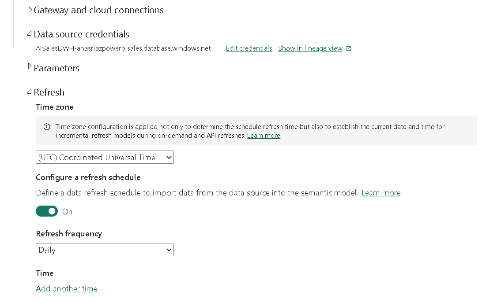
  <br/><em>Setting up automated daily data refresh in the Power BI Service.</em>
</p>

---

## Project Assets File Structure

All project assets are organized in this repository for clarity and ease of access.

```
/
|-- .gitignore
|-- README.md
|-- LICENSE
|-- powerbi-ai-sales-analysis.pbix
|-- assets/
|   |-- images/
|   |   |-- azure_resource_group.png
|   |   |-- pbi_model_view.png
|   |   |-- adf_pipeline_run.png
|   |   |-- adf_pipeline_log.png
|   |   |-- datalake_files.png
|   |   |-- power_query_profiling.png
|   |   |-- refresh_config.png
|   |   |-- report_dashboard_main.png
|   |   |-- report_dashboard_agent.png
|   |   |-- ai_key_influencers.png
|   |   |-- ai_top_segments.png
|   |   |-- ai_decomp_tree.png
|   |   |-- ai_clustering.png
|   |-- video/
|   |   |-- report_demo.mp4
|   |   |-- report_demo.gif
|   |-- docs/
|       |-- report_export.pdf
|       |-- report_export.pptx
|-- data/
    |-- agents.csv
    |-- customers.csv
    |-- call_logs.csv
```

---

## Conclusion & Key Takeaways

This project successfully delivered a robust and insightful BI solution, proving the value of the new AI sales model. More importantly, it served as a comprehensive exercise in applying modern data analytics principles and tools in a simulated enterprise environment. Key skills demonstrated include cloud data engineering, optimized data modeling, advanced DAX, interactive report design, and enterprise deployment strategies.
